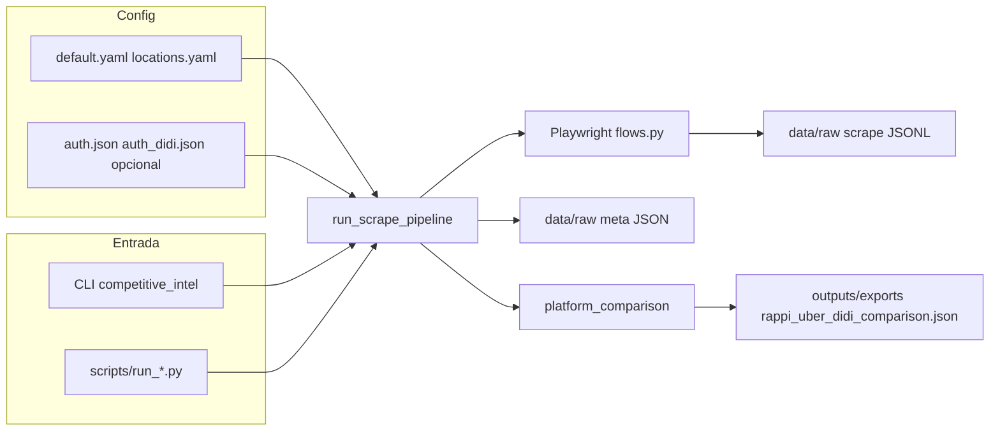

# Competitive Intelligence — Delivery México

Herramienta para **inteligencia competitiva** en delivery en México: automatiza la recolección de señales comparables (**precios de menú, tiempos y costos de envío visibles en UI**) en **Rappi**, **Uber Eats** y **DiDi Food** mediante **Playwright**, y genera un **JSON de comparación multi-plataforma** (ancla Rappi vs Uber y vs DiDi) por ubicación y cadena.

## Alcance actual

| Plataforma   | Estado en código | Notas |
|--------------|------------------|--------|
| **Rappi**    | Operativo        | Dirección por ubicación, sesión opcional (`auth.json`), varias cadenas por corrida, menú con scroll (límite configurable en YAML). |
| **Uber Eats**| Operativo        | Dirección, búsqueda de cadena, extracción de ítems con precio en la vista. |
| **DiDi Food**| Operativo        | Incluido por defecto en `platforms.enabled` junto a Rappi y Uber ([`config/default.yaml`](config/default.yaml)): feed, dirección, búsqueda de cadena (variantes de nombre), menú con scroll (`menu_items_limit`), retorno al feed entre cadenas (logo + fallback `goto`). Sesión opcional en **`config/auth_didi.json`** (archivo distinto al de Rappi). |

La orquestación vive en [`src/competitive_intel/pipelines/run_scrape.py`](src/competitive_intel/pipelines/run_scrape.py); la navegación y extracción, en [`src/competitive_intel/scrapers/flows.py`](src/competitive_intel/scrapers/flows.py) (`FLOW_REGISTRY`: `rappi`, `uber_eats`, `didi_food`).

---

## Requisitos previos

- **Python 3.11+** (ver [`pyproject.toml`](pyproject.toml)).
- **Google Chrome** instalado en el sistema: el scrape usa `chromium.launch(..., channel="chrome")`. Si no tienes Chrome, habría que cambiar el código para usar solo el Chromium que instala Playwright (`channel` omitido o `chromium`).
- Cuenta / sesión según exija cada sitio: Rappi (`auth.json`), DiDi Food (`auth_didi.json`). Uber puede usarse en muchos casos sin archivo de sesión propio.

---

## Instalación

```bash
python -m venv .venv
# Windows PowerShell:
.\.venv\Scripts\Activate.ps1
pip install -U pip
pip install -r requirements.txt
pip install -e .
playwright install chromium
```

- `pip install -e .` registra el paquete **`competitive_intel`** desde `src/`.
- Dependencias de desarrollo opcionales: `pip install -e ".[dev]"` (pytest, ruff).

---

## Arquitectura



| Ruta | Rol |
|------|-----|
| [`config/default.yaml`](config/default.yaml) | Plataformas activas (Rappi, Uber, DiDi), timeouts, delays, cadenas, bloques `rappi` / `uber_eats` / `didi_food`. |
| [`config/locations.yaml`](config/locations.yaml) | Ubicaciones de scrape (`id`, `address_line` o `label`, `zone_type`, etc.). |
| [`src/competitive_intel/scrapers/flows.py`](src/competitive_intel/scrapers/flows.py) | Flujos Playwright y `FLOW_REGISTRY`. |
| [`src/competitive_intel/scrapers/throttle.py`](src/competitive_intel/scrapers/throttle.py) | Pausas entre pasos, ubicaciones, plataformas y cadenas. |
| [`src/competitive_intel/pipelines/run_scrape.py`](src/competitive_intel/pipelines/run_scrape.py) | Orquestación del scrape y disparo de la comparación. |
| [`src/competitive_intel/analysis/platform_comparison.py`](src/competitive_intel/analysis/platform_comparison.py) | Emparejamiento de productos y JSON **anclado en Rappi** (Uber, DiDi, matches triples). |
| [`src/competitive_intel/transform/canonical.py`](src/competitive_intel/transform/canonical.py) | Mapeo a modelo `OfferSnapshot` (uso con filas ya normalizadas). |
| [`src/competitive_intel/reporting/generate_report.py`](src/competitive_intel/reporting/generate_report.py) | Pipeline de informe (estado limitado; ver sección **report**). |
| [`src/competitive_intel/reporting/competitive_insights_from_export.py`](src/competitive_intel/reporting/competitive_insights_from_export.py) | Resumen analítico + figuras a partir del JSON de comparación (vía script). |
| `data/raw/` | JSONL crudo y `*_meta.json`. |
| `outputs/exports/` | `rappi_uber_didi_comparison_<UTC>.json` y, si generas insights, `*_insights_summary.json` y PNG. |

Más detalle: [`docs/ARCHITECTURE.md`](docs/ARCHITECTURE.md).

---

## Configuración

### 1. Entorno (opcional)

Copia [`.env.example`](.env.example) a `.env` si usas variables locales.

| Variable | Efecto |
|----------|--------|
| `CI_MX_DATA_DIR` | Raíz de datos (por defecto `data/` en el repo). |
| `CI_MX_OUTPUT_DIR` | Raíz de salidas (por defecto `outputs/`). |
| `CI_MX_ENV` | Etiqueta de entorno en settings (opcional). |

Definidas en [`src/competitive_intel/config.py`](src/competitive_intel/config.py).

### 2. `config/default.yaml` (resumen)

- **`platforms.enabled`**: por defecto `rappi`, `uber_eats`, `didi_food` (puedes comentar o quitar una plataforma).
- **`scraping`**: `navigation_timeout_ms`, `headless`, `delay_seconds`, `delay_jitter_seconds`, `between_locations_seconds`, `between_platforms_seconds`, `comparison_similarity` (umbral 0.5–1.0 para nombres de productos). Comentario en YAML: el JSON de comparación multi-plataforma se escribe en `outputs/exports/` con el mismo timestamp que el scrape.
- **`scraping.chains`**: cadenas compartidas; overrides opcionales en `scraping.rappi.chains`, `scraping.uber_eats.chains`, `scraping.didi_food.chains`.
- **`scraping.rappi`**: `menu_items_limit` (`null` o `0` = intentar todo el menú vía scroll), `between_chains_seconds`, `delay_seconds`, `debug_page_dumps`, `debug_page_dir`.
- **`scraping.uber_eats`**: `between_chains_seconds`.
- **`scraping.didi_food`**: `between_chains_seconds`, `menu_items_limit` (`null` / `0` = hasta tope interno con scroll).

Si aparece **HTTP 429**, aumenta los `delay_*` y `between_*` o reduce ubicaciones/cadenas por corrida.

### 3. Ubicaciones

1. Crea **`config/locations.yaml`**. Si no existe, el pipeline usa **`config/locations.template.yaml`** (suele venir vacío).
2. Puedes partir de [`config/locations.example.yaml`](config/locations.example.yaml).

Cada ítem suele incluir al menos: `id`, `address_line` (o `label`), y opcionalmente `zone_type`.

### 4. Sesiones Playwright (`storage_state`)

**Rappi — `config/auth.json`**

- **No subir a git** (`.gitignore`). Plantilla: [`config/auth.json.example`](config/auth.json.example).
- Primera vez: `scrape --headed` sin `auth.json`; login en el navegador y **Enter** en la terminal; el pipeline guarda y reutiliza la sesión al cerrar el contexto Rappi.

**DiDi Food — `config/auth_didi.json`**

- Archivo **aparte** de Rappi: Playwright sobrescribe todo el JSON al guardar; así no se pierde la sesión de Rappi al persistir DiDi.
- **No subir a git**. Plantilla: [`config/auth_didi.json.example`](config/auth_didi.json.example).
- Primera vez: `python -m competitive_intel scrape --platform didi_food --headed` (o run completo con DiDi habilitado); si no hay cookies válidas, el flujo pide login y guarda `auth_didi.json`. Si la pestaña queda en el portal de login unificado, el pipeline evita sobrescribir cookies buenas (ver logs).

### 5. `reference_products.yaml`

El pipeline **lee** el archivo y guarda en el `meta` del scrape el **número** de productos de referencia definidos. **Hoy no se usa** para filtrar ni para buscar ítems en `flows.py`; el scrape captura lo visible en menú / listados según la implementación actual.

---

## Uso: línea de comandos

### `scrape`

```bash
python -m competitive_intel scrape --dry-run
python -m competitive_intel scrape
python -m competitive_intel scrape --headed
python -m competitive_intel scrape --platform rappi
python -m competitive_intel scrape --platform uber_eats -v
python -m competitive_intel scrape --platform didi_food --headed
python -m competitive_intel scrape --max-locations 2
python -m competitive_intel scrape --rappi-dump-pages
python -m competitive_intel scrape --config-dir /ruta/a/config
```

Equivalente con script:

```bash
python scripts/run_scrape.py --dry-run
python scripts/run_scrape.py --headed
```

| Flag | Descripción |
|------|-------------|
| `--dry-run` | Valida config y ubicaciones; no abre navegador. |
| `--headed` | Navegador visible (`headless=false`). |
| `--platform` | Solo `rappi`, `uber_eats` o `didi_food` (debe existir en `FLOW_REGISTRY`). |
| `-v` / `--verbose` | Logs DEBUG (timings, sesión, detalle). |
| `--max-locations` | Solo las primeras N ubicaciones. |
| `--rappi-dump-pages` | Activa volcados HTML/PNG/meta para depurar Rappi (ver `default.yaml`). |

### `compare`

Regenera o genera el JSON de comparación a partir de un JSONL (por defecto el **`scrape_*.jsonl` más reciente** en `data/raw/`).

```bash
python -m competitive_intel compare
python -m competitive_intel compare --input data/raw/scrape_20260331T120000Z.jsonl
python -m competitive_intel compare --output outputs/exports/mi_comparacion.json --similarity 0.85
```

```bash
python scripts/run_compare.py --input data/raw/scrape_20260331T120000Z.jsonl
```

- Genera un bloque por cada par **`location_id` + cadena** donde hay fila **Rappi** y al menos **Uber Eats o DiDi Food** (pueden estar las tres).
- Incluye `rappi_vs_didi_food`, `triple_matched_products` y `counts_triple` cuando hay datos de DiDi (y Uber para el triple).
- Filas con **`status == "error"`** no entran al emparejamiento.

### Resumen de insights (JSON + gráficos)

A partir de un export `rappi_uber_didi_comparison_*.json`, el script genera `*_insights_summary.json` y tres PNG en el mismo directorio (`outputs/exports/`):

```bash
python scripts/generate_competitive_insights.py --input outputs/exports/rappi_uber_didi_comparison_<stamp>.json
```

Sin `--input`, toma el comparativo más reciente en `outputs/exports/`. Requiere **matplotlib** (incluido en [`requirements.txt`](requirements.txt)).

### `report`

```bash
python -m competitive_intel report
python -m competitive_intel report --input data/processed/offers_normalized.jsonl
python scripts/run_report.py --input data/processed/offers_normalized.jsonl
```

- Si el archivo de entrada **no existe**, se escribe un stub en `outputs/reports/report_stub.json`.
- Si existe un JSONL/CSV normalizado, hoy los “insights” en [`analysis/insights.py`](src/competitive_intel/analysis/insights.py) son **placeholders** (“Pendiente”) hasta conectar lógica real al esquema de columnas.

---

## Qué hace un run de `scrape`

1. Carga `default.yaml`, ubicaciones y lista de productos de referencia (solo para meta).
2. Para cada plataforma en `enabled` (o la indicada en `--platform`):
   - Crea contexto Playwright; carga `config/auth.json` si la plataforma es **Rappi** y el archivo existe; carga `config/auth_didi.json` si la plataforma es **DiDi** y el archivo tiene cookies válidas.
   - Para cada ubicación (con pausas entre ubicaciones/plataformas):
     - Ejecuta el flujo correspondiente en `flows.py` (dirección, tiendas por cadena, extracción).
3. Escribe **`data/raw/scrape_<UTC>.jsonl`** (una línea JSON por registro, típicamente por plataforma × ubicación × cadena).
4. Escribe **`data/raw/scrape_<UTC>_meta.json`** con rutas, conteos y, si aplica, ruta del JSON de comparación.
5. Si hay al menos una fila, intenta generar **`outputs/exports/rappi_uber_didi_comparison_<UTC>.json`** (mismo `<UTC>` que el JSONL). Si falla, verás un **WARNING** en log; el JSONL igual se guarda.
6. **Salida en consola**: al final imprime las secciones `=== scrape: filas ===` y `=== scrape: meta ===` con **todo el contenido** de las filas y el meta en JSON (útil para depurar; puede ser muy grande).

---

## Formato de salidas (alto nivel)

### JSONL (`scrape_*.jsonl`)

Cada línea es un objeto. Campos comunes (base en `_base_record` y extensiones en `flows.py`):

- `scraped_at`, `platform`, `location_id`, `address_used`, `status` (`ok` / `partial` / `error`), `error`, `final_url`
- **Rappi**: `chain`, `products_sample` (lista de `{name, price_raw, price_mxn, ...}` según extracción), `delivery_eta_raw`, `delivery_fee_raw`, `store_rating_raw`, `menu_error`, `menu_items_limit`, etc.
- **Uber Eats**: `chain`, `menu_items`, `store_delivery_fee`, `store_delivery_time`, etc.
- **DiDi Food**: `chain`, `menu_items`, y campos de fee/tiempo cuando el scrape los rellena (`store_delivery_fee` / `store_delivery_time` o equivalentes mapeados en comparación).

Para el detalle exacto de cada plataforma, revisa el JSONL generado o [`flows.py`](src/competitive_intel/scrapers/flows.py).

### JSON de comparación (`rappi_uber_didi_comparison_*.json`)

- `generated_at`, `similarity_threshold`, `source_scrape_file`, `comparison_scope` (`rappi_anchored_multi_platform`), `platforms`
- `comparisons[]`: por cada `(location_id, cadena)` con **Rappi** y al menos **Uber o DiDi**:
  - `platforms_present`, `delivery_comparison` (bloques `rappi`, `uber_eats`, `didi_food` y deltas cuando hay datos parseables)
  - **Rappi vs Uber:** `matched_products`, `rappi_only_products`, `uber_eats_only_products`, `counts`
  - **Rappi vs DiDi:** `rappi_vs_didi_food` (matches, `rappi_only_products`, `didi_food_only_products`, `counts`) o **`null`** si no hubo fila DiDi para esa ubicación/cadena
  - **Triple:** `triple_matched_products`, `counts_triple.matched_three_platforms`

Matching por **nombre** normalizado y similitud (`SequenceMatcher`), umbral desde `comparison_similarity` o `--similarity` en `compare`.

---

## Logging

- Sin `-v`: nivel **INFO** reducido (progreso por ubicación, resumen del run, ruta del JSON de comparación, **WARNING**/**ERROR**).
- Con **`-v`**: **DEBUG** (timings, carga de sesión, detalle por cadena, etc.).

---

## Pruebas

```bash
python -m pytest tests
```

---

## Problemas conocidos, ética y documentación

- Lista viva de incidencias y mitigaciones: [**docs/KNOWN_ISSUES.md**](docs/KNOWN_ISSUES.md) (anti-bot, 429, fee de envío Rappi a veces no parseada, celdas vacías en comparación, etc.).
- Criterio de ubicaciones: [**docs/LOCATIONS.md**](docs/LOCATIONS.md).
- Respeta **Términos de uso** de cada plataforma, **rate limiting**, minimiza carga en sus servidores y trata credenciales y dumps como **datos sensibles**.

---

## Roadmap sugerido (alineado al código)

1. Pipeline **raw JSONL →** normalización **→** `data/processed/offers_normalized.jsonl` usando [`transform/canonical.py`](src/competitive_intel/transform/canonical.py) y el contrato de filas que definas.
2. Conectar [`analysis/insights.py`](src/competitive_intel/analysis/insights.py) al esquema real o consolidar con el resumen de [`competitive_insights_from_export.py`](src/competitive_intel/reporting/competitive_insights_from_export.py).
3. Mejorar extracción de **fee de envío**, ETA y **service fee** en `flows.py` cuando la UI lo permita (hoy el comparativo se apoya en lo parseable por plataforma).
4. Opcional: flag **`--quiet`** para no volcar el JSON completo de filas en stdout tras cada scrape.
5. Opcional: dashboard interactivo (Streamlit, etc.) consumiendo `*_insights_summary.json`.

---

## Licencia y uso

Uso previsto: **prueba técnica / evaluación**. Ajusta autor y licencia según las políticas del proceso de selección o de tu organización.
